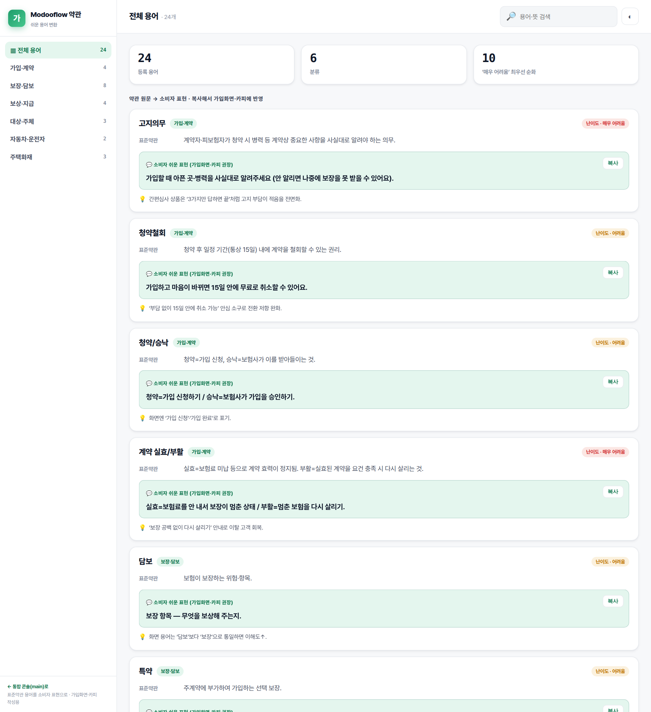
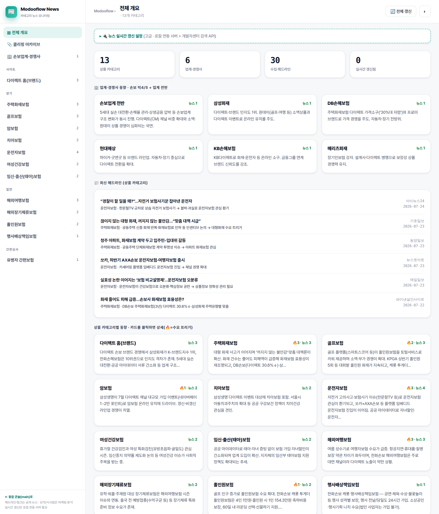
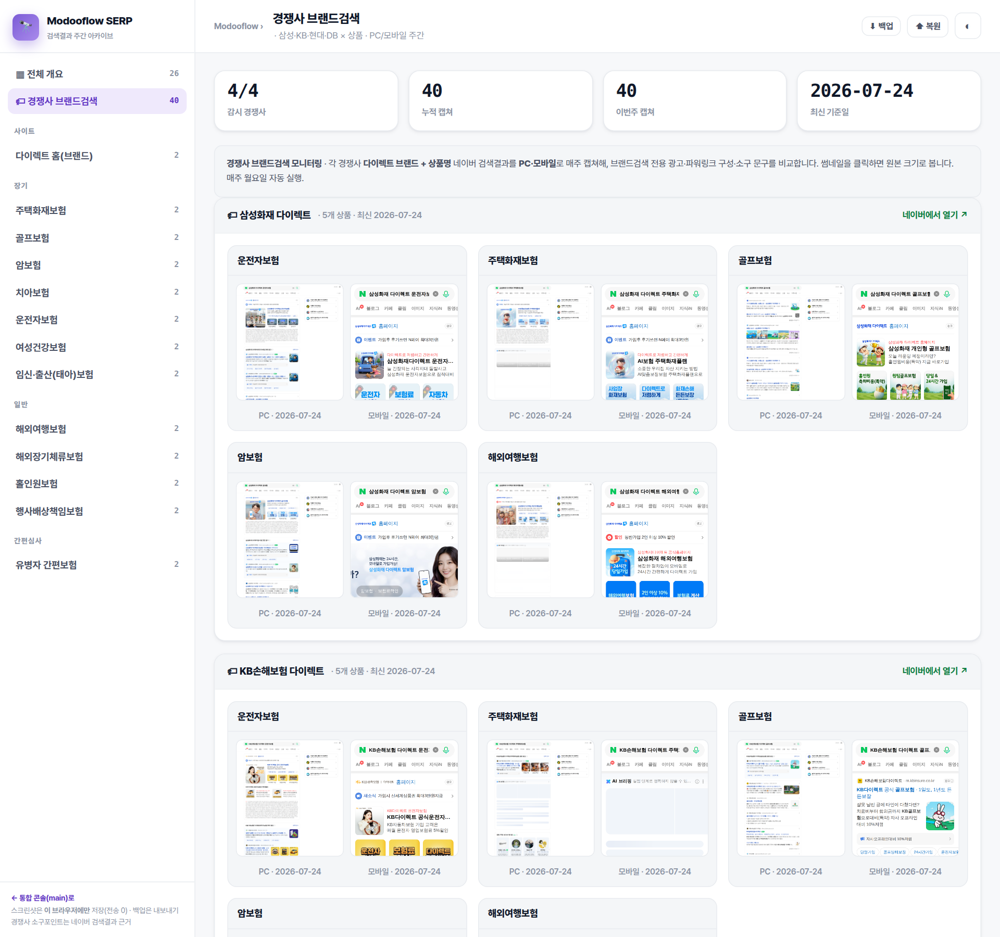
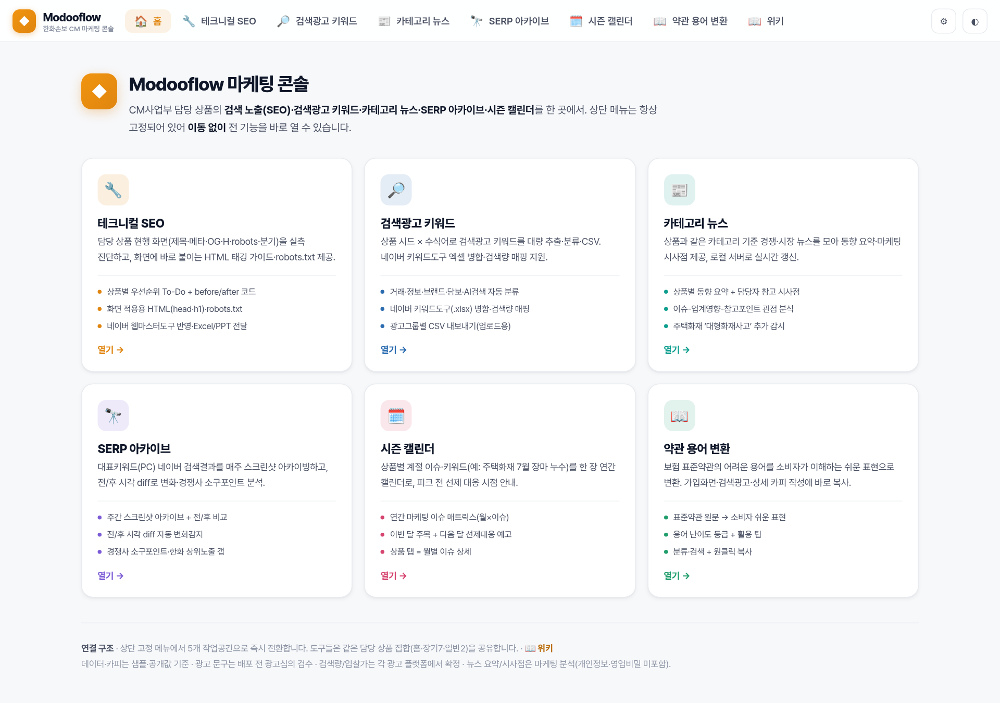

# 클로드 스킬 구축기 & 적용 전후 — 발표 문서

_한화손보 장기CM · Modooflow · 2026-07-24_

> **발표 한 줄:** "담당자가 일하는 방식을 클로드 스킬로 자산화했더니, 반복 리서치·정리가 수 분으로 줄고 산출물 품질이 표준화됐다."

**구성:** ① 스킬 구축 과정(어떻게 시작·디벨롭) → ② 적용 전후 결과물 비교(스크린샷) → ③ 접속 주소·파일

---

## 1. 스킬 구축 과정 — 시작부터 디벨롭까지

### 1-1. 왜 시작했나 (문제 정의)

장기CM 마케팅 업무에는 **반복 리서치·정리**가 많았습니다.

| 병목 업무 | 기존 방식의 문제 |
|---|---|
| 뉴스·경쟁사 동향 브리핑 | 매번 검색·선별·정리 → **회당 30~60분**, 사람마다 품질 편차 |
| 약관 용어를 쉬운 카피로 | **감(感)으로 순화** → 용어 오남용·심의 리스크, 표현이 자산으로 안 남음 |
| 헤드라인 → 보고/SNS 카드 | 기획·요약을 매번 수작업 |

→ "매번 다시 설명하지 않아도, **우리 기준대로** AI가 처리하게 하자"가 출발점.

### 1-2. 디벨롭 타임라인 (실제 개발 순서)

```
1단계  통합 허브 + '분석 스킬' 씨앗 도입 (작업공간 3분할 시)
        └ 뉴스/키워드/SEO 콘솔을 만들며 "담당자 관점 분석"을 스킬로 분리
2단계  cm-news-analysis 정식화 + card-news-summary 신설 (뉴스 고도화)
        └ 톤·출력구조를 '엄격 준수' 규격으로 승격, 카드뉴스 포맷 파생
3단계  insurance-terms 스킬 + 약관 변환 툴(terms-tool) 신설
        └ 표준약관 근거 + 난이도 등급 + 심의 전제를 규칙화, 6번째 툴로 연결
4단계  MCP 결합 — NaverSearch MCP 수집 → 스킬 분석 → 콘텐츠 자동 갱신
        └ 메인 3종 뉴스를 스킬 기준으로 재작성(수집·분석 반자동화)
```

### 1-3. 스킬 하나를 만드는 표준 절차 (제작 레시피)

각 `SKILL.md`는 아래 5요소로 구조화 — 이게 "디벨롭 레시피"입니다.

1. **트리거(description)** — 어떤 키워드·맥락에서 자동 발동할지 명시 (예: "뉴스 분석", "약관 용어", "카드뉴스")
2. **역할·톤** — 담당자 관점, 인사말·미사여구 금지, 시사점 중심
3. **출력 구조(엄격 준수)** — 핵심요약→상세, 이슈·영향·참고 3요소 등 포맷 고정
4. **툴 데이터 스키마 연결** — 산출물이 곧 `terms-tool`의 TERMS, `news-tool`의 카드로 들어가도록 규격 일치
5. **거버넌스 병기** — 공개·비식별 데이터만, 광고성 문구는 심의 전제

### 1-4. 완성된 스킬 3종

| 스킬 | 하는 일 | 연결 툴 |
|---|---|---|
| **cm-news-analysis** | 뉴스·경쟁사(손보 빅4/5) 동향을 담당자 관점으로 분석(요약→상세, 이슈·영향·참고, 메인3종 강조, 수요 트리거) | `news-tool.html` |
| **card-news-summary** | 헤드라인 묶음 → 카드뉴스(제목≤24자·요지≤45자·담당자 액션) | 보고/SNS 카드 |
| **insurance-terms** | 표준약관 어려운 용어 → 소비자 쉬운 표현·가입 카피(난이도 등급·심의 전제) | `terms-tool.html` |

---

## 2. 적용 전후 결과물 비교 (스크린샷)

### 2-1. 약관 용어 → 소비자 표현 (`insurance-terms`)

| 구분 | 적용 전 | 적용 후 |
|---|---|---|
| 방식 | 담당자가 감으로 순화 | 표준약관 근거 → 소비자 표현 **자동 규격화** |
| 정확성 | 면책·감액 오인 소지 | 불리 조건 정확 + **난이도 등급**(매우 어려움 우선 순화) |
| 재사용 | 1회성, 흩어짐 | **복사 버튼**으로 가입화면·카피에 바로 반영, 24개 용어 자산화 |

**적용 후 화면** — 표준약관 원문 옆에 소비자 쉬운 표현·난이도·담당자 팁이 카드로 정리됨:



> 예) **고지의무**(난이도: 매우 어려움) → "가입할 때 아픈 곳·병력을 사실대로 알려주세요 (안 알리면 나중에 보장을 못 받을 수 있어요)." / **청약철회** → "가입하고 마음이 바뀌면 15일 안에 무료로 취소할 수 있어요."

### 2-2. 뉴스·경쟁사 동향 (`cm-news-analysis`)

| 구분 | 적용 전 | 적용 후 |
|---|---|---|
| 리서치 | 수동 검색·선별 **회당 30~60분** | NaverSearch MCP 수집 + 스킬 분석 → **수 분** |
| 포맷 | 담당자마다 제각각 | **요약→상세 · 이슈/영향/참고 3요소** 표준 |
| 경쟁사 | 산발적·주관적 | 손보 **빅4/5 표준 요약·시사점** 일괄 |
| 실행 연결 | 없음 | 상품별 **🔥수요 트리거**로 대응 키워드 제시 |

**적용 후 화면** — 업계·경쟁사 동향 + 상품 13종 카테고리별 시사점 + 수요 트리거:



> 예) **운전자보험** → "자전거 고의사고·보험사기 이슈로 관심 환기, 쏘카×AXA손보 등 플랫폼 임베디드 진입 → 채널 경쟁 확대" (🔥 수요 트리거)

### 2-3. 경쟁사 브랜드검색 자동 모니터링 (스킬 분석과 연계)

경쟁사(삼성·KB·현대·DB) 다이렉트 브랜드검색을 **PC·모바일로 매주 자동 캡쳐** → 브랜드검색 광고·소구 문구 변화를 스킬 분석과 함께 해석:



> 적용 전: 경쟁사 화면을 수동으로 캡쳐·비교 → 적용 후: **주 40컷 자동 축적**(4사 × 5상품 × PC/모바일), 전주 대비 변화 추적.

### 2-4. 카드뉴스 (`card-news-summary`)

- **적용 전:** 헤드라인 모아 보고/SNS용으로 매번 수작업 기획·요약
- **적용 후:** 헤드라인만 넣으면 **제목·요지·담당자 액션 3줄 카드 초안** 즉시 (뉴스 콘솔 카드와 동일 포맷)

### 2-5. 통합 콘솔 — 스킬이 붙는 실제 작업공간

스킬 산출물이 반영되는 6개 도구를 한 허브에서 운영:



---

## 3. 접속 주소·파일

| 구분 | 주소 / 경로 |
|---|---|
| **배포 대시보드** | `https://imsplendid8.github.io/CM-CMO/` |
| **전체 접속 안내 페이지** | `https://imsplendid8.github.io/CM-CMO/overview.html` |
| **저장소** | `https://github.com/imsplendid8/CM-CMO` |
| **이 발표 문서** | `docs/발표-클로드스킬.md` (스크린샷 `docs/img/`) |
| **스킬 3종** | `.claude/skills/cm-news-analysis · card-news-summary · insurance-terms` |
| **연결 툴** | `news-tool.html` · `terms-tool.html` · `serp-tool.html` |
| **자동 수집물** | `serp/brand/`(브랜드검색 40컷) · `serp/`(상품 SERP) · `data/clips/`(뉴스 클리핑) |

> ⚠️ 도구를 **파일 더블클릭(file://)** 으로 열면 자동 캡쳐·갤러리가 fetch 차단으로 비어 보입니다. **배포 주소(http)** 로 열거나 `python3 -m http.server` 후 접속하세요.

---

## 4. 정량 기대효과 (추정)

- 뉴스·동향 리서치 시간 **약 70~80% 단축**
- 산출물 **품질 편차 최소화** (표준 포맷·기준 고정)
- 약관 카피 **심의 리스크·재작업 감소** (표준약관 근거 + 난이도 등급)
- 신규 담당자 **온보딩 단축** — 스킬 = 살아있는 업무 매뉴얼

## 5. 리스크·거버넌스 (반드시 병기)

- **공개·비식별 데이터만** — 고객·임직원 개인정보·영업비밀 입력 금지(가상 치환)
- 광고성 문구는 **광고심의 검수 전제** — AI 산출물은 **초안**, 최종 판단·검수는 사람
- 약관 순화 표현은 **면책·감액 등 불리 조건을 정확히**(오인 소지 배제)

## 6. 확장 로드맵

- **다음 스킬 후보:** 브랜드검색 계약 판단(단가표 기반), SEO 카피 생성, 타사 브랜드검색 분석
- **수집→분석→반영 파이프라인:** MCP 수집 → 스킬 분석 → 대시보드 자동 반영으로 확대
- 스킬은 붙일수록 **효과가 누적**되는 팀 공용 자산

## 7. 한 줄 결론

> **"담당자의 일하는 방식을 AI 스킬로 자산화하면, 반복 리서치·정리는 자동화하고 사람은 판단·전략에 집중한다."**
> 이미 3개 스킬(뉴스·약관·카드뉴스)이 실제 툴에 적용 중이며, MCP와 결합해 수집–분석–반영이 반자동화됐습니다.

---

_스크린샷은 실제 Modooflow 툴을 로컬 렌더로 캡쳐(`scripts/capture_skilldoc.mjs`, `scripts/capture_docimg.mjs`). 노션 임포트 시 `docs/img/`의 이미지를 함께 업로드하세요._
